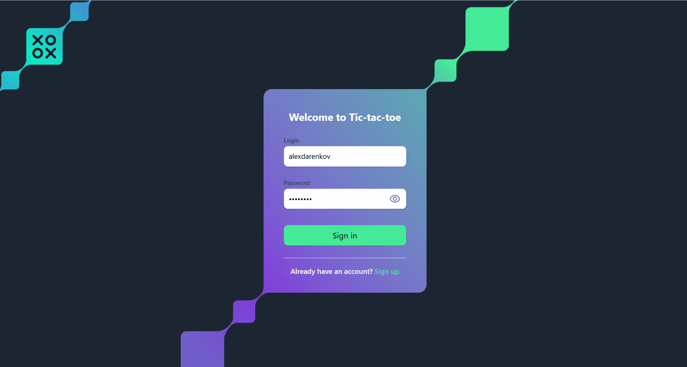

# Tic Tac Toe Multiplayer

[](https://java.com)
[](https://spring.io/projects/spring-boot)
[](https://vuejs.org)
[](https://postgresql.org)
[](https://docker.com)

Многопользовательская онлайн-платформа для игры в крестики-нолики с поддержкой PvP и игры против ИИ.  
**Особенности:** JWT-авторизация, WebSocket, рейтинговая таблица, адаптивный дизайн.



## Особенности
- 🌐 **Онлайн-мультиплеер** через WebSocket
- 🤖 **Игра против ИИ** которого невозможно победить
- 🏆 **Топ игроков** с подсчетом рейтинга
- 🔒 **JWT-авторизация** с refresh-токенами
- 📱 **Адаптивный интерфейс** на Vue.js + Tailwind CSS
- 🐳 **Готовая Docker-сборка** с PostgreSQL

## Технологии
| Backend              | Frontend            | Инфраструктура       |
|----------------------|---------------------|---------------------|
| Java 17              | Vue.js 3            | Docker + Compose    |
| Spring Boot 3.1      | Tailwind CSS        | PostgreSQL 15       |
| Spring Security      | Vue Router          | JWT Auth            |
| Spring WebSocket     | Axios               | WebSocket STOMP     |

## Установка
1. Клонировать репозиторий:
```bash
git clone https://github.com/alexdarenkov/JavaTicTacToe.git
cd JavaTicTacToe
```
2. Запустить через Docker Compose:
```bash
docker-compose up --build
```
3. Перейдите по ссылке: http://localhost